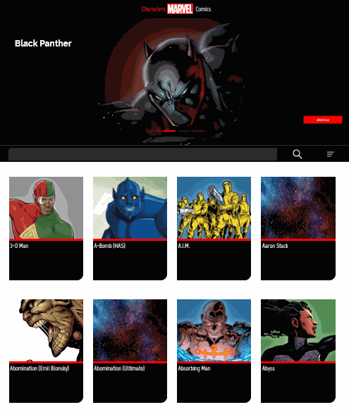
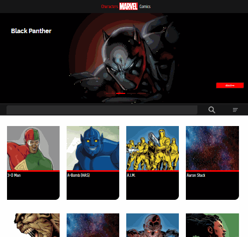

# Marvel
# 🦸An entertainment app built using the Marvel Comics API


### This is an entertainment application. 
### You can find the hero of comics you are interested in by name or its initial characters, as well as by id. 
### It is possible to sort by hero name and modification date
 


### The same manipulations can be performed on the comics page. There are more fields for sorting here.


### You can get more information about the hero or comic by going to his (its) page




## Project usage
 - Vue 3 
 - JavaScript 
 - HTML 
 - SASS 
 - CSS 
 - Gulp.js 
 - Swiper
 - API  
 - Responsive  layout  
 - Icomoon             
 - BEM 
## Project setup
```
npm install
```

### Compiles and hot-reloads for development
```
npm run serve
```

### Compiles and minifies for production
```
npm run build
```

### Lints and fixes files
```
npm run lint
```

### Customize configuration
See [Configuration Reference](https://cli.vuejs.org/config/).
